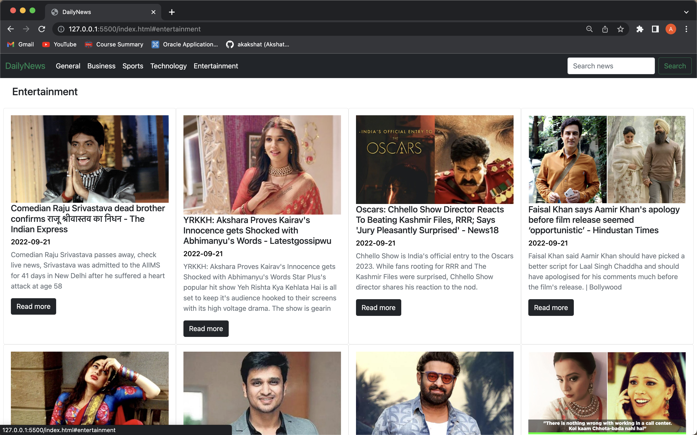
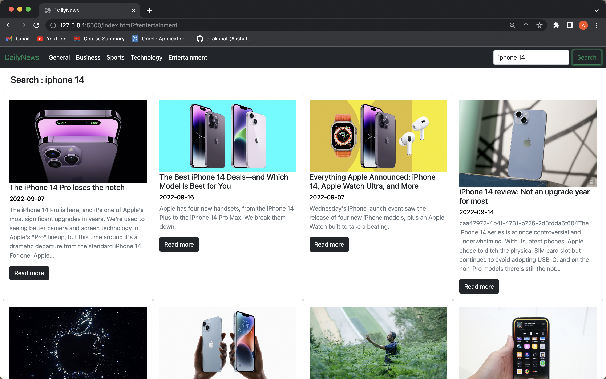
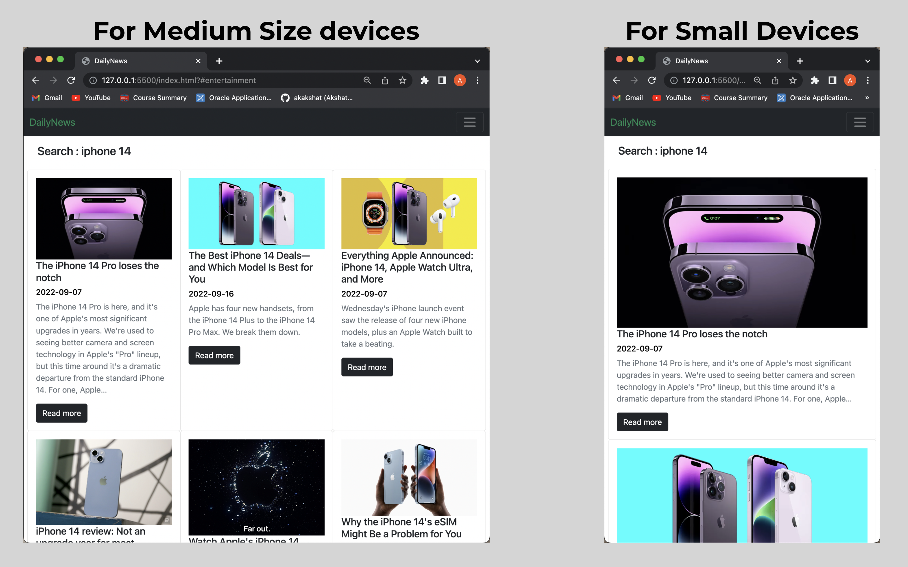

# DailyNews

A responsive website that delivers you the best and the updated news of all time.
Use the filter if you want the news of the particular section for eg(business, technology).
Search for your favourite topic in the news for eg(the latest iphone 14) and 
if you want to read more about the topic click on the "Read More" button
it will redirect you to the news source.

## API Reference

#### Get all items

```http
  newsapi.org/v2/top-headlines?country=in&api_key
```

| Parameter | Type     | Description                |
| :-------- | :------- | :------------------------- |
| `api_key` | `string` | 6a1d4f2afd3b4379bd04f56e72a8bb6d |

#### Get item

Takes the news and display on the DailyNews Website.


## Demo

The landing page carries the Headlines.


Followed by General news, Business news, Sports news, Technology news and than Entertainment related news.




Search for your favourite or latest topic of the news here. 


Check for the responsiveness of the site.



 
